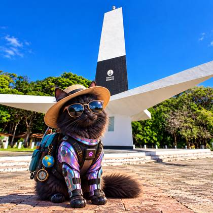

# Guia Vênus 🐈‍⬛ 🌴📍

  

  <strong>Alguns cantos da Paraíba que a gente gosta e indicaria aos amigos. 🌴☀️</strong>

---

## Sobre

O **Guia Vênus** nasceu de uma situação simples: amigos de outros estados que vinham conhecer João Pessoa frequentemente perguntavam onde ir, quais praias conhecer, onde comer e quais lugares valiam a visita.

Em vez de repetir as mesmas indicações individualmente, o projeto reúne em um único lugar uma **curadoria pessoal, gratuita e independente** de praias, restaurantes, bares, passeios, cultura e pontos turísticos em **João Pessoa, Cabedelo e Conde**.

A proposta não é ser um catálogo completo de turismo, nem substituir os canais oficiais dos locais. É um guia simples para ajudar quem está chegando a encontrar ideias e seguir para a fonte original antes da visita.

---

## 🏠 Guia Vênus e Vênus Casa de Praia - PB

O Guia também funciona como um recurso complementar da **Vênus Casa de Praia - PB**, facilitando o compartilhamento de indicações com hóspedes, visitantes e pessoas que acompanham o perfil da casa.

📱 Instagram: [@venuscasadepraiapb](https://www.instagram.com/venuscasadepraiapb/)

Essa relação não altera a independência das indicações: os estabelecimentos, atrações e serviços listados não pagam pela inclusão e não são apresentados como parceiros do Guia, salvo quando isso for informado de forma expressa.

---

## 📱 O que é possível fazer

O Guia foi pensado principalmente para uso pelo celular e permite:

- pesquisar lugares por nome, região, perfil ou descrição;
- filtrar por cidade e categoria;
- salvar favoritos no próprio navegador;
- visualizar detalhes de cada indicação;
- abrir a localização no Google Maps;
- acessar sites, fontes oficiais ou redes sociais;
- alternar a interface entre português e espanhol;
- instalar o Guia como PWA em dispositivos compatíveis;
- consultar o conteúdo principal offline após o primeiro carregamento.

Tudo isso sem exigir cadastro ou login.

---

## 🗺️ Como as indicações são organizadas

Sempre que possível, cada indicação possui localização, descrição curta, categoria, perfil, Google Maps e uma fonte ou rede social.

A seleção pode crescer conforme novos lugares forem conhecidos, visitados ou considerados interessantes para o Guia.

As inclusões e revisões são registradas diretamente na base do projeto e no [📋 CHECKLIST_FONTES.md](CHECKLIST_FONTES.md), mantendo o README estável mesmo quando novos lugares são adicionados.

---

## 🌐 Aplicativo leve e instalável

O Guia foi desenvolvido como uma **Progressive Web App (PWA)**. Ele funciona diretamente pelo navegador e, em dispositivos compatíveis, pode ser instalado na tela inicial do celular.

🔗 [Acessar o Guia Vênus](https://guia-lugares-pb.vercel.app/)

---

## 📴 Funcionamento offline

Após o primeiro acesso, os principais arquivos do Guia podem ficar armazenados em cache. Assim, parte do conteúdo continua disponível quando a conexão estiver limitada ou indisponível.

Google Maps, Instagram, sites oficiais e outras fontes externas continuam dependendo de internet.

---

## ⭐ Favoritos

Os favoritos são armazenados localmente no navegador. Não é necessário criar conta e eles não são sincronizados automaticamente entre aparelhos diferentes.

Essa escolha mantém o Guia simples e evita a necessidade de armazenar dados pessoais dos visitantes.

---

## ♿ Acessibilidade e experiência

O projeto inclui navegação por teclado, foco visual, identificação adequada de controles, estado acessível dos favoritos, áreas de toque adequadas, suporte à preferência de redução de movimento, menu responsivo e interface em português e espanhol.

---

## 🔎 Fontes das informações

Sempre que possível, as informações são conferidas em páginas oficiais de turismo, prefeituras, sites dos próprios locais e redes sociais dos estabelecimentos e atrações.

A relação utilizada na revisão do conteúdo pode ser consultada em:

[📋 CHECKLIST_FONTES.md](CHECKLIST_FONTES.md)

Algumas referências públicas abrangem um município ou conjunto de atrativos, e não necessariamente uma página individual para cada local. Horários, preços, programação, condições de acesso, marés e disponibilidade podem mudar; confirme essas informações na fonte antes da visita.

---

## ⚠️ Importante

O **Guia Vênus** é um guia pessoal de indicações. A inclusão de um estabelecimento ou atração é gratuita e informativa.

O Guia não realiza reservas, não recebe pagamentos, não cobra comissão pela indicação e não garante serviços oferecidos por terceiros.

---

## 🛠️ Tecnologias utilizadas

- HTML5
- CSS3
- JavaScript
- Progressive Web App (PWA)
- Service Worker
- Web App Manifest
- LocalStorage
- Vercel

<strong>📂 Estrutura técnica do projeto</strong>

 

- `index.html` — estrutura principal;
- `style.css` — estilos e responsividade;
- `ux-venus.css` — melhorias complementares de interface;
- `app.js` — busca, filtros, favoritos e interações;
- `ux-venus.js` — camada de experiência e idioma;
- `dados.js` — base principal utilizada pelo aplicativo;
- `lugares.csv` — cópia tabular sincronizada da base;
- `manifest.webmanifest` — configuração do PWA;
- `sw.js` — cache e funcionamento offline;
- `CHECKLIST_FONTES.md` — acompanhamento das fontes;
- `guia-venus-turista.jpg` — identidade visual atual do Guia.

---

## ✅ Projeto concluído

A versão atual do **Guia Vênus** está funcionalmente concluída. A partir deste ponto, o projeto entra em **manutenção**, permitindo incluir novos lugares, atualizar links e revisar informações sem alterar a estrutura principal da aplicação.

---

## 👩‍💻 Sobre o projeto

Projeto pessoal desenvolvido por **Priscilla Cahino**.

Além da programação, o projeto envolve experiência do usuário, organização da informação, acessibilidade, curadoria, validação de dados, manutenção de conteúdo e experiência do cliente.

---

  <strong>Guia Vênus 🐈‍⬛</strong> 
  <em>Um jeito simples de compartilhar alguns cantos da Paraíba com quem está chegando.</em>

---

**Desenvolvido por Priscilla Cahino**
