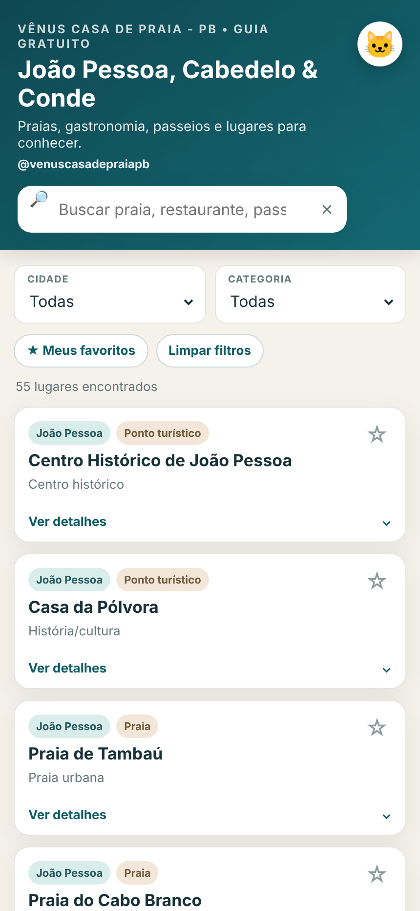
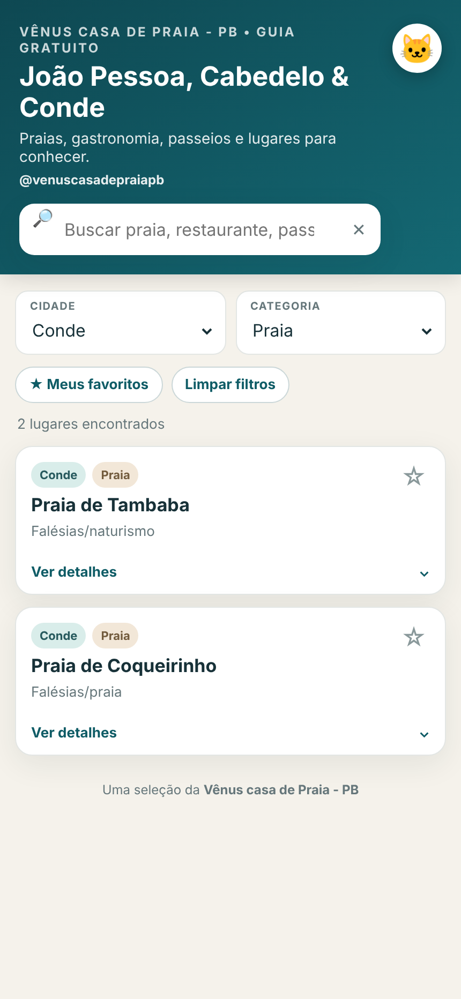
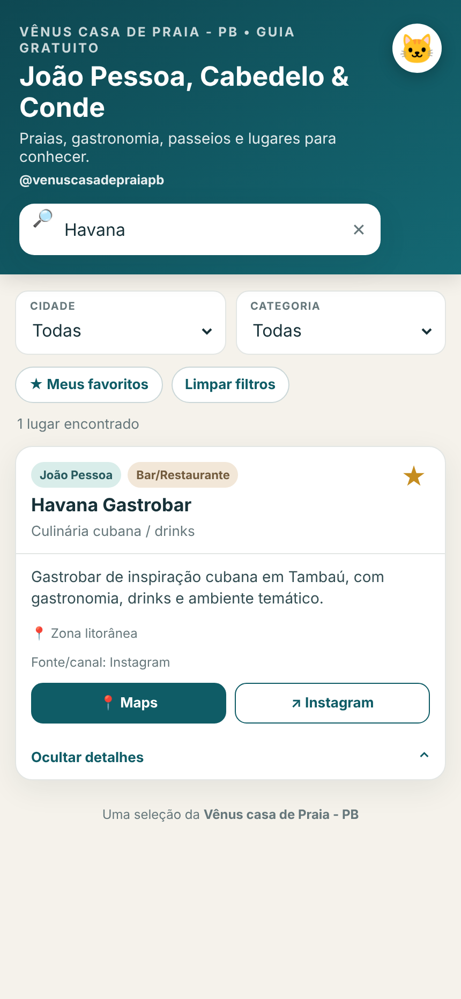

# 🌴 Guia Vênus — João Pessoa, Cabedelo e Conde

> Um guia pessoal de lugares que eu conheço e indicaria para amigos e visitantes que vêm conhecer a Paraíba.

  <a href="https://guia-lugares-pb.vercel.app/">
    <strong>🌐 Acessar o Guia Vênus</strong>
  </a>

---

## 💡 Como surgiu o Guia

O **Guia Vênus** nasceu de uma situação simples: amigos de outros estados que vinham conhecer João Pessoa frequentemente me perguntavam onde ir, quais praias conhecer, onde comer e quais lugares eu indicaria durante a viagem.

Em vez de repetir as mesmas indicações individualmente, resolvi reunir em um único lugar alguns dos cantos que conheço e considero interessantes.

A proposta não é criar um catálogo completo de turismo.

O Guia é uma **curadoria pessoal de lugares que eu conheço e indicaria para amigos e visitantes**.

Atualmente, a seleção reúne indicações em:

- 📍 João Pessoa
- 📍 Cabedelo
- 📍 Conde

Entre as sugestões estão praias, restaurantes, bares, passeios, gastronomia, cultura e pontos turísticos.

---

## 🏠 Guia Vênus e Vênus Casa de Praia - PB

Com a evolução do projeto, o Guia também passou a ser utilizado como um recurso complementar da **Vênus Casa de Praia - PB**.

A ideia é facilitar o compartilhamento das indicações com visitantes, hóspedes e pessoas que acompanham o perfil da casa.

📱 Instagram: [@venuscasadepraiapb](https://www.instagram.com/venuscasadepraiapb/)

Apesar dessa integração, o Guia mantém sua proposta original: ser uma **curadoria pessoal, gratuita e independente** de lugares que considero interessantes para conhecer na região.

A presença de um estabelecimento no Guia não representa parceria comercial ou publicidade contratada.

---

## 📱 O que é possível fazer

O Guia foi pensado principalmente para utilização pelo celular.

Atualmente é possível:

- 🔎 pesquisar lugares por nome, região, perfil ou descrição;
- 📍 filtrar por cidade;
- 🏖️ filtrar por categoria;
- ⭐ salvar lugares favoritos;
- 📖 visualizar detalhes de cada indicação;
- 🗺️ abrir a localização diretamente no Google Maps;
- 🔗 acessar sites, fontes oficiais ou redes sociais;
- 📲 instalar o Guia como PWA em dispositivos compatíveis;
- 📴 consultar o conteúdo principal offline após o primeiro carregamento.

Tudo isso sem exigir cadastro ou login.

---

## 🗺️ Lugares

O Guia reúne indicações distribuídas entre **João Pessoa, Cabedelo e Conde**.

Sempre que possível, cada indicação possui:

- localização;
- breve descrição;
- categoria;
- perfil da indicação;
- acesso ao Google Maps;
- site, fonte oficial ou rede social.

A seleção pode continuar crescendo conforme novos lugares forem conhecidos, visitados ou considerados interessantes para o Guia.

---

## 📸 Conheça o Guia

O Guia foi desenvolvido pensando principalmente na utilização pelo celular.

### 📱 Tela inicial

A tela inicial reúne busca, filtros por cidade e categoria, favoritos e acesso às indicações cadastradas.

  

---

### 🔎 Busca e filtros

É possível combinar cidade e categoria para encontrar rapidamente os lugares desejados.

No exemplo abaixo, o Guia apresenta resultados relacionados às praias de Conde.

  

---

### 📍 Detalhes, favoritos e localização

Cada indicação pode apresentar descrição, localização, fonte oficial ou rede social.

Também é possível marcar lugares como favoritos e abrir a localização diretamente no Google Maps.

  

---

## 🌐 Aplicativo leve e instalável

O Guia foi desenvolvido como uma **Progressive Web App (PWA)**.

Isso permite que ele funcione diretamente pelo navegador e, em dispositivos compatíveis, também possa ser instalado na tela inicial do celular.

A proposta foi manter o projeto simples e leve, sem exigir publicação em uma loja de aplicativos.

🔗 [Acessar o Guia Vênus](https://guia-lugares-pb.vercel.app/)

---

## 📴 Funcionamento offline

Após o primeiro acesso, os principais arquivos do Guia podem ficar armazenados em cache.

Isso permite que parte do conteúdo continue disponível mesmo quando a conexão com a internet estiver limitada ou indisponível.

Recursos externos, como Google Maps, Instagram, sites oficiais e outras fontes, continuam dependendo de conexão com a internet.

---

## ⭐ Favoritos

Os lugares marcados como favoritos são armazenados localmente no navegador.

Isso significa que:

- não é necessário criar uma conta;
- nenhum cadastro é exigido;
- os favoritos permanecem no navegador utilizado;
- os favoritos não são sincronizados entre aparelhos diferentes.

Essa escolha mantém o Guia simples e evita a necessidade de armazenar dados pessoais dos usuários.

---

## ♿ Acessibilidade

O projeto também recebe melhorias voltadas à acessibilidade.

Entre os recursos implementados estão:

- identificação adequada de campos de formulário;
- navegação por teclado;
- indicação do estado dos favoritos;
- botão acessível para abrir e fechar os detalhes;
- foco visual durante a navegação por teclado;
- suporte à preferência de redução de movimento do dispositivo.

As melhorias de acessibilidade continuam fazendo parte da evolução do projeto.

---

## 🛠️ Tecnologias utilizadas

O projeto utiliza uma estrutura propositalmente simples e leve:

- HTML5
- CSS3
- JavaScript
- Progressive Web App (PWA)
- Service Worker
- Web App Manifest
- LocalStorage
- Vercel

A escolha por essa arquitetura faz parte da própria proposta do Guia: oferecer uma experiência rápida e funcional sem exigir uma estrutura complexa para uma necessidade simples.

---

## 🔎 Fontes das informações

Sempre que possível, as informações do Guia são conferidas por meio de:

1. páginas oficiais de turismo;
2. sites de prefeituras e outros órgãos públicos;
3. sites oficiais dos locais indicados;
4. redes sociais dos próprios estabelecimentos.

Essas fontes ajudam a manter as informações mais confiáveis e facilitam a consulta antes da visita.

A relação das fontes utilizadas pode ser consultada em:

[📋 CHECKLIST_FONTES.md](CHECKLIST_FONTES.md)

---

## ⚠️ Importante

Este é um **guia pessoal de indicações**.

A inclusão de um estabelecimento ou atração não representa vínculo comercial, publicidade contratada ou garantia dos serviços oferecidos.

Informações como horários, preços, programação, funcionamento, condições climáticas, marés e disponibilidade podem sofrer alterações.

Antes da visita, consulte sempre o canal oficial do estabelecimento ou atração.

---

<strong>📂 Estrutura técnica do projeto</strong>

 

O Guia utiliza uma estrutura simples e leve:

- `index.html` — estrutura principal;
- `style.css` — identidade visual e responsividade;
- `app.js` — busca, filtros, favoritos e interações;
- `dados.js` — base de lugares;
- `manifest.webmanifest` — configuração do PWA;
- `sw.js` — cache e funcionamento offline;
- `lugares.csv` — dados auxiliares;
- `CHECKLIST_FONTES.md` — auditoria das fontes;
- `venus-gata.jpeg` — identidade visual da Vênus;
- `docs/imagens/` — imagens utilizadas na documentação;
- arquivos de ícones utilizados pelo aplicativo.

---

## 🚧 Projeto em evolução

O Guia Vênus continua recebendo melhorias.

Entre as evoluções previstas estão:

- revisão contínua das indicações;
- atualização das fontes;
- novas melhorias de acessibilidade;
- aperfeiçoamento da experiência mobile;
- inclusão de novas indicações conforme a evolução do Guia;
- demonstração curta do funcionamento do aplicativo.

A intenção é continuar evoluindo o projeto sem perder sua principal característica:

> **Ser simples, útil e fácil de acessar.**

---

## 🎯 Decisões do projeto

Algumas decisões foram tomadas propositalmente para manter o Guia adequado ao seu objetivo.

### Sem cadastro obrigatório

O visitante pode utilizar o Guia imediatamente, sem criar conta ou fornecer dados pessoais.

### Estrutura leve

Para uma aplicação de indicações, uma arquitetura simples atende à necessidade atual sem adicionar complexidade desnecessária.

### Experiência mobile

O Guia foi pensado principalmente para pessoas que estão passeando ou viajando e utilizam o celular para consultar rapidamente onde ir.

### Acesso rápido à localização

Os locais podem ser abertos diretamente no Google Maps, reduzindo etapas entre encontrar uma indicação e chegar ao destino.

### Fontes identificadas

Sempre que possível, o Guia direciona o visitante para uma fonte oficial, site ou rede social do próprio estabelecimento.

---

## 👩‍💻 Sobre o projeto

Projeto pessoal desenvolvido por **Priscilla Cahino**.

O Guia nasceu a partir de indicações que eu já compartilhava com amigos e visitantes e foi transformado em uma experiência digital também como parte do meu aprendizado e desenvolvimento na área de tecnologia.

Além da programação, o projeto envolve decisões relacionadas a:

- experiência do usuário;
- organização da informação;
- acessibilidade;
- experiência mobile;
- curadoria e validação de dados;
- manutenção de conteúdo;
- experiência do cliente.

---

  <strong>⭐ Guia Vênus</strong>

  <em>Alguns cantos da Paraíba que eu conheço e indicaria para quem está chegando.</em>

